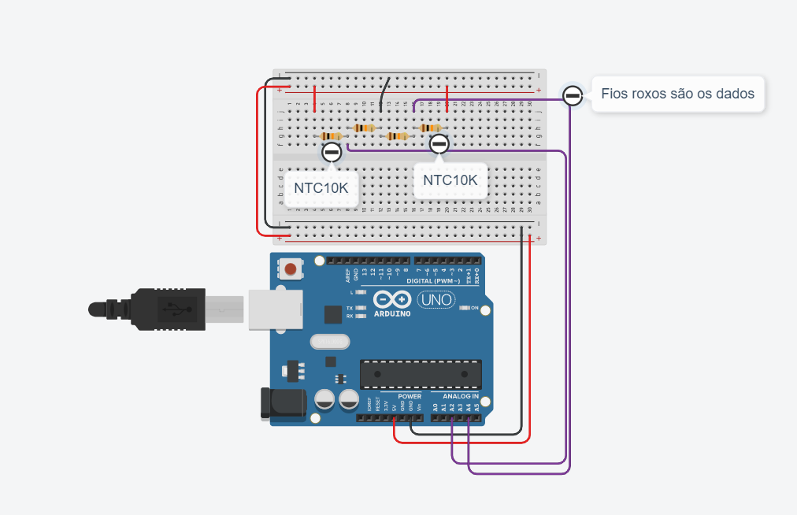

# Como medir temperatura
Aqui vamos ver na prática como podemos utilizar sensores como o LM35 e o NTC10K para medir a temperatura de um sistema.

## LM35
O LM35 é muito prático de se utilizar para medir temperaturas, tendo em vista que você alimentou ele da forma correta, basta medir a tensão do seu terminal do meio (terminal de dados) e fazer uma conversão relativamente simples. Segue a fórmula:

>

Onde T é a temperatura, Vo é a tensão do terminal de dados e 0.01 é uma constante do fabricante.
Portanto, é possível utilizar até mesmo o multímetro para conseguir medir as temperaturas.

## NTC10K 
O NTC10K é bastante prático também pelo fato de que sua funcionalidade é baseada num termistor, ou seja, um resistor que varia a resistência em função da temperatura. A função de transdução é dada pela equação de Steinhart-Hart, que já está implementada no código em arduino (em estatistica.ino).

## Montagem do circuito com 2 sensores NTC10K

### Equipamento necessário:
- [x] Arduino uno.
- [x] 2 Sensores NTC10K.
- [x] 2 Resistores de 10KOhms.
- [x] Jumpers.