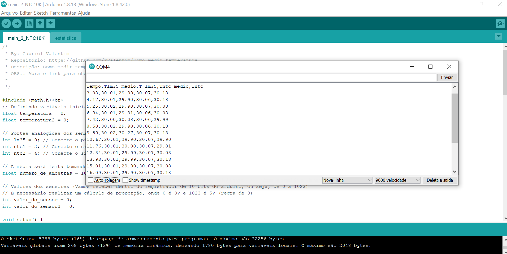
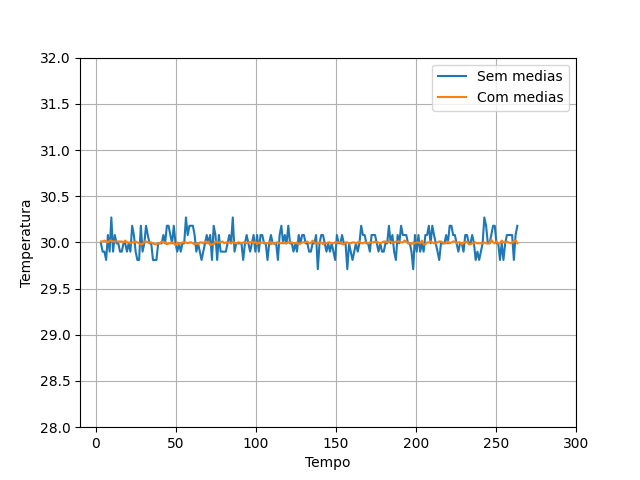
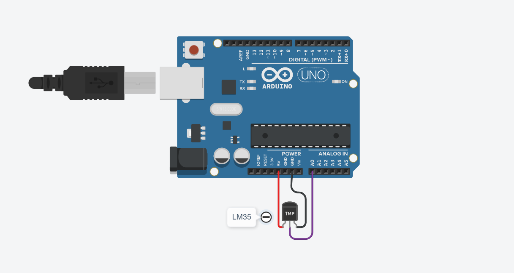

# Como medir temperatura
Aqui vamos ver na prática como podemos utilizar sensores como o LM35 e o NTC10K para medir a temperatura de um sistema.

## LM35
O LM35 é muito prático de se utilizar para medir temperaturas, tendo em vista que você alimentou ele da forma correta, basta medir a tensão do seu terminal do meio (terminal de dados) e fazer uma conversão relativamente simples. Segue a fórmula:

>

Onde T é a temperatura, Vo é a tensão do terminal de dados e 0.01 é uma constante do fabricante.
Portanto, é possível utilizar até mesmo o multímetro para conseguir medir as temperaturas.

## NTC10K 
O NTC10K é bastante prático também pelo fato de que sua funcionalidade é baseada num termistor, ou seja, um resistor que varia a resistência em função da temperatura. A função de transdução é dada pela equação de Steinhart-Hart, que já está implementada no código em arduino (em estatistica.ino).

## Utilização do Arduino para coletar os dados
Para o processo de medição de temperatura, o Arduino pode ser uma ferramenta excelente, tendo em vista sua velocidade de processamento. Facilmente você pode medir milhares de pontos (com relativa precisão numérica) de temperatura e construir um gráfico com os dados em seu Monitor Serial:

Note que os valores já vêm formatados e separados por vírgula. A primeira linha representa as colunas. Dessa forma, com um arquivo .csv facilmente conseguimos plotar um gráfico utilizando o Python e as bibliotecas matplotlib.pyplot e o Pandas.

## Montagem do circuito com 2 sensores NTC10K

### Equipamento necessário:
- [x] Arduino uno.
- [x] 2 Sensores NTC10K.
- [x] 2 Resistores de 10KOhms.
- [x] Jumpers.

Na pasta "main_2_NTC10K" contém os programas .ino para coletar os dados de temperatura e printar no Monitor Serial do arduino (leia os comentários no código). Selecione os dados no Monitor Serial cole em um bloco de notas, salve com o final ".csv" e será gerado um arquivo tal e qual o data.csv.

### Coleta dos dados com o Python
Nesse tópico, basta utilizar o código em Python em ambos os diretorios, utilizando o Pandas ele abrirá o arquivo .csv e construirá uma tabela cujas colunas são os nome da primeira linha do arquivo .csv (abra o arquivo e veja), em seguida guardará cada coluna em uma lista e plotará no final. Gerando a seguinte imagem:

### Médias
Note que o os sensores têm uma precisão (grau de concordância entre os pontos) que pode ser melhorada utilizando médias aritméticas. A função que calcula médias, desvio padrão da amostra, incertezas e outras estão implementadas em estatistica.ino. Utilize de acordo com sua necessidade.

## Montagem do circuito com 1 LM35

### Equipamento necessário:
- [x] Arduino uno.
- [x] 1 LM35.

Na pasta main_1_lm35 contém os programas .ino para coletar os dados de temperatura e printar no Monitor Serial do arduino (leia os comentários no código). Selecione os dados no Monitor Serial cole em um bloco de notas, salve com o final ".csv" e será gerado um arquivo tal e qual o data.csv.

## Tecnologias usadas nesse projeto

